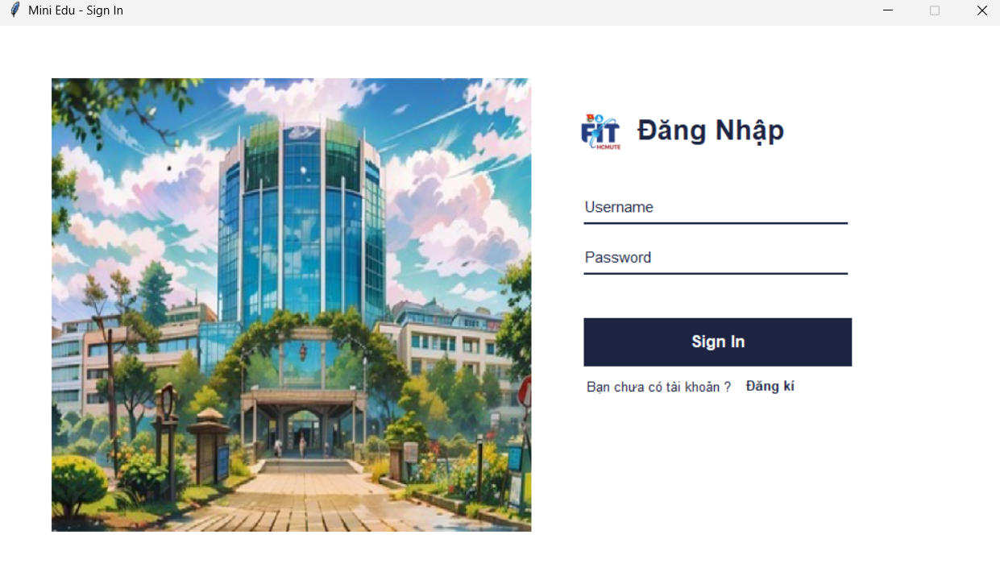
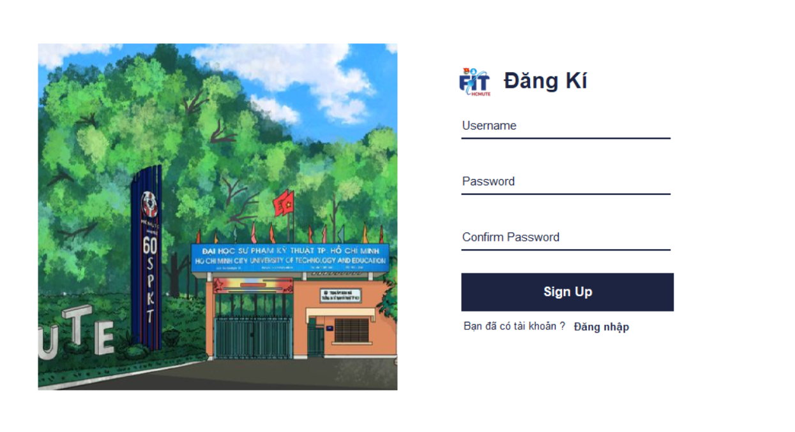
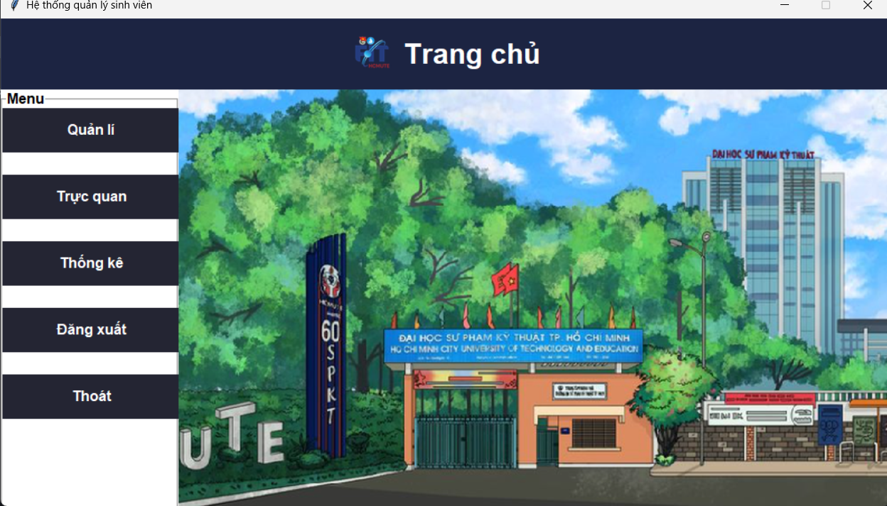
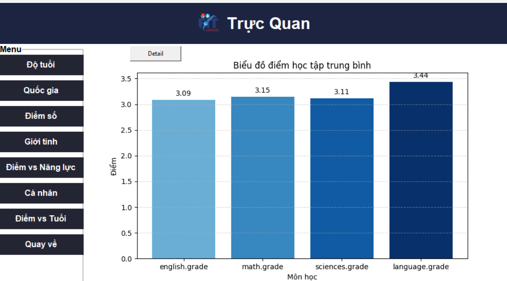

# 🐍 ĐỒ ÁN PYTHON – Ứng dụng Quản lý & Phân tích Dữ liệu Sinh viên

---

## 👨‍💻 Nhóm thực hiện

### Thành viên 1
- **Họ và tên**: Phạm Hàn Minh Chương  
- **MSSV**: 23110187  
- **Vai trò**: Code GUI, chức năng CRUD, Leader, quản lý dự án, lên kế hoạch, điều phối nhóm

### Thành viên 2
- **Họ và tên**: Nguyễn Thanh Bình Minh  
- **MSSV**: 23110266  
- **Vai trò**: Code chức năng làm sạch, thống kê dữ liệu, sắp xếp dữ liệu

### Thành viên 3
- **Họ và tên**: Nguyễn Thị Thanh Thùy  
- **MSSV**: 23110336  
- **Vai trò**: Trực quan hóa dữ liệu, vẽ biểu đồ, chuẩn hóa & phân tích dữ liệu

---

## 🗂️ Cấu trúc thư mục đồ án

student-management/
├── data/ # Dữ liệu thô và đã xử lý
│ ├── student-dataset.csv
│ ├── sorted_by_age.csv
│ ├── sorted_by_gpa.csv
│ ├── data_clean.csv
│ └── users.txt
│
├── modules/ # Chức năng xử lý dữ liệu
│ ├── data_cleaning.py
│ ├── data_crud.py
│ ├── data_visualization.py
│ └── student_function.py
│
├── gui/ # Giao diện người dùng
│ ├── login_page.py
│ ├── signup_page.py
│ ├── home_page.py
│ ├── manage_page.py
│ ├── student_page.py
│ └── view_page.py
│
├── images/ # Ảnh minh hoạ
│ ├── gui_home.png
│ ├── chart_gpa.png
│ └── login_screen.png
│
├── tests/ # Unit tests
│ ├── test_cleaning.py
│ ├── test_crud.py
│ └── test_visualization.py
│
├── main.py # File chạy chính
├── requirements.txt # Thư viện phụ thuộc
└── README.md # Hướng dẫn này

---

## 🖼️ Ảnh minh hoạ giao diện
<p align="center">
  
</p>
<p align="center">
  
</p>
<p align="center">
  
</p>
<p align="center">
  
</p>

---

## 🚀 Hướng Dẫn Chạy Ứng Dụng

### ⚙️ Yêu cầu

- Python >= 3.10
- Hệ điều hành Windows (khuyến khích)
- Các thư viện: `pandas`, `matplotlib`, `pillow`, `tkinter`, `mplcursors`

### 🔰 Cách 1: Tự động cài thư viện khi chạy

1. Tải mã nguồn về
2. Mở Terminal hoặc CMD, `cd` vào thư mục dự án
3. Chạy:
   ```bash
   python main.py
